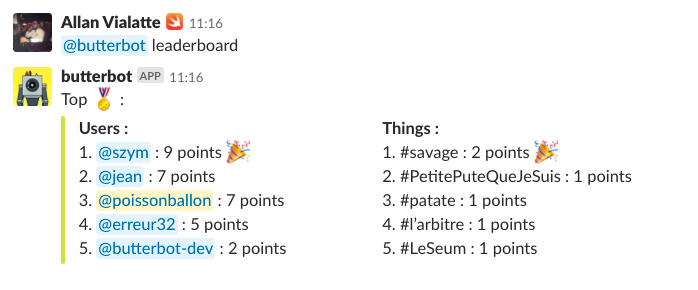
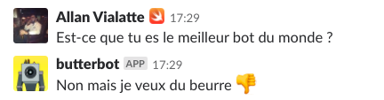

<h3 align="center">
<a href="https://github.com/NoRespect/ButterBot">

 
 
</a>
ButterBot
</h3>

------

Butterbot is a blazingly dumb bot written in Swift 4.1 with Vapor 3.

This project doesn't use IA / Machine learning / Neural Network, or *[random_hype_technology]* but just a fucking good old fashion parser.

**Butterbot talk only in french for now :confused:** :fr:

# Functionalities

All the architecture is designed to add easily feature but the question is : Will I have the motivation to do it ?

# Installation

## Why ?

Coz I can,

## Karma

Add and remove points to create incredible war and bad mood on your slack.

#### Usage :

<table style="width:100%">
 <tr>
  <th>Command</th>
  <th>Usage</th>
  <th>Example</th>
 </tr>
 <tr>
  <td>Add Point</td>
  <td>Add point to a member or thing</td>
  <td>@poisson ++ <i>or</i> #thing ++</td>
 </tr>
 <tr>
  <td>Remove Point</td>
  <td>Remove point to a member or thing</td>
  <td>@poisson -- <i>or</i> #thing --</td>
 </tr>
 <tr>
  <td>Leaderboard</td>
  <td>Show top X member or thing</td>
  <td>@butterbot leaderboard <i>[optional_top]<i> </td>
 </tr>
</table>

#### Screenshot :

## AskMe

Butterbot answers any sentence with `Est-ce que`

#### Screenshot :

## TalkTooMuch

< Coming Soon >

# Author

* PoissonBallon [@poissonballon](https://twitter.com/poissonballon)
* All NoRespect Team https://github.com/orgs/NoRespect/people

# License

Butterbot is available under the WTFPL *(Do What the Fuck You Want to Public License)* license.

Check the website for more information : http://www.wtfpl.net/
